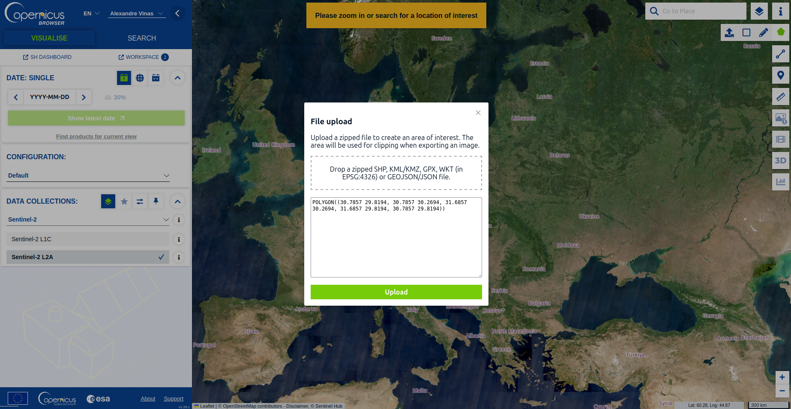
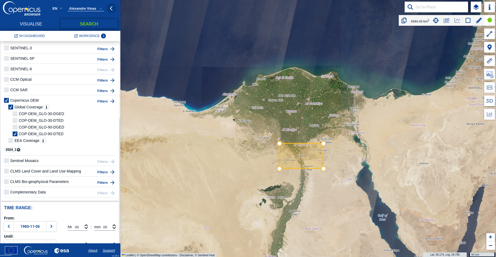
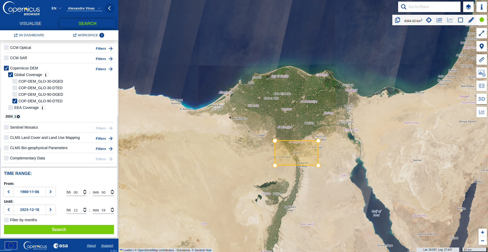
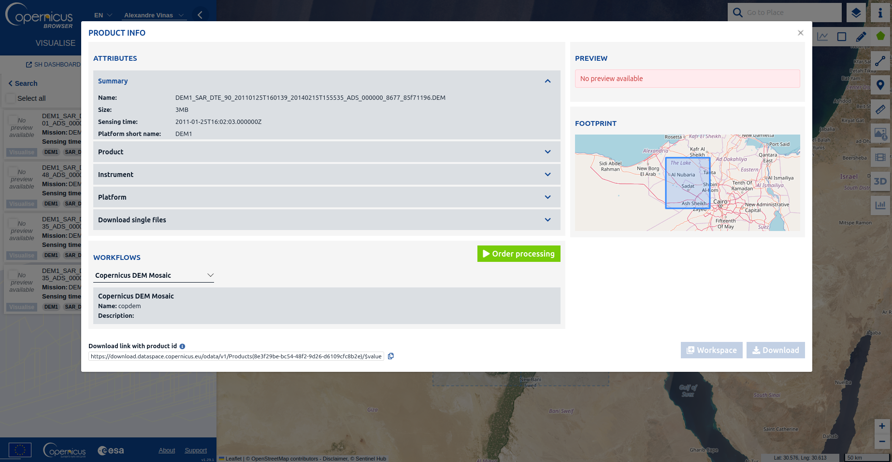
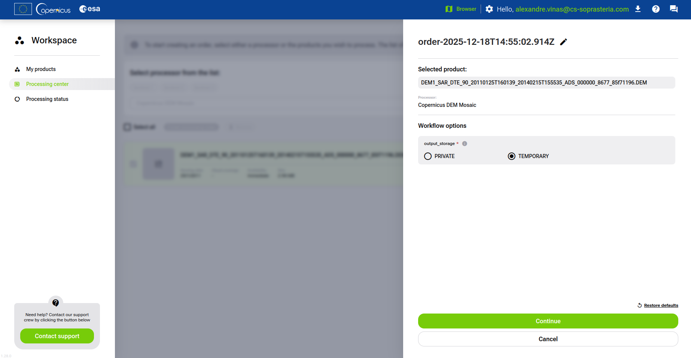
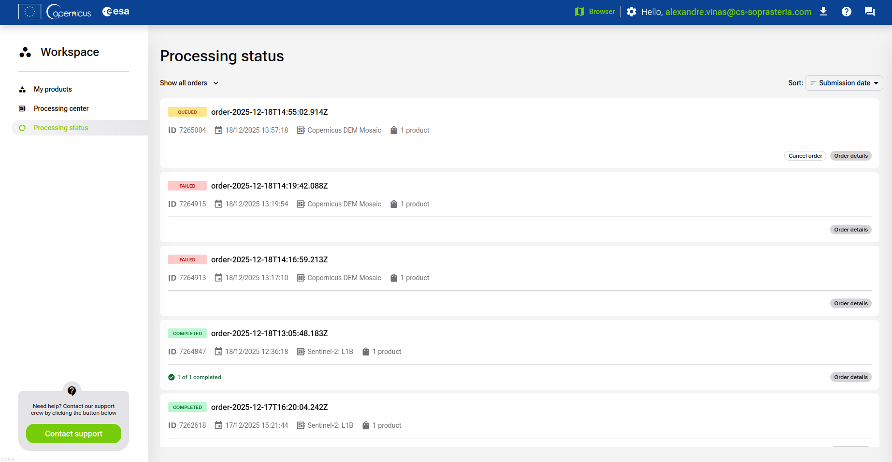
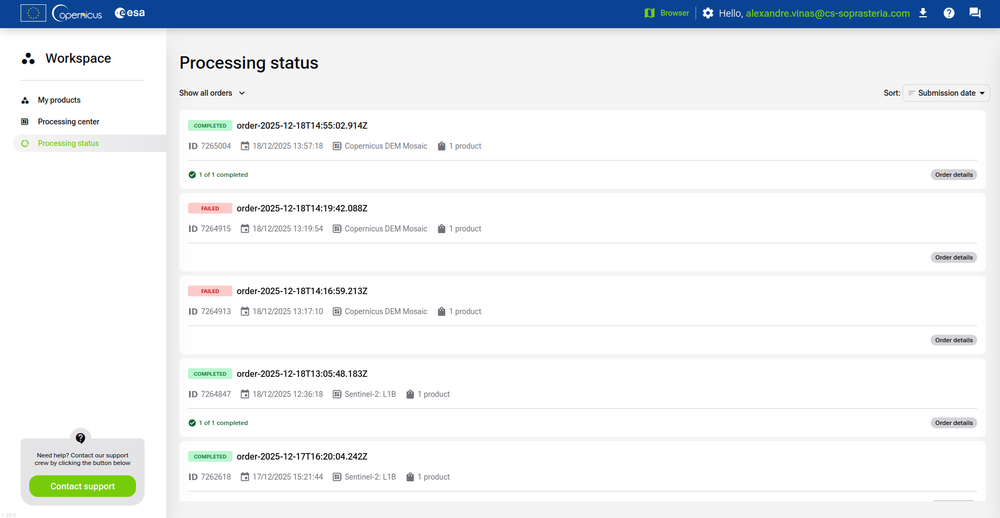
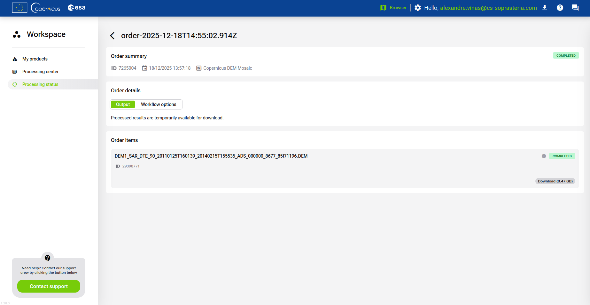

[README](../../README.md)

* [HOWTO](../Usage/HOWTO.md)
* [Inputs description](../Input/input_description.md)

  * [How to Download L1B Data from CDSE](../Input/L1B_CDSE_Download.md)
  * [How to Download DEM Data from CDSE](../Input/DEM_CDSE_Download.md)

* Outputs description:

  * [Direct location grids](../Output/output_direct_loc.md)
  * [Inverse location grids](../Output/output_inverse_loc.md)
  * [Output grids usage](../Output/output_grids_usage.md)

# How to Download Copernicus DEM from Copernicus Data Space Browser

**Prerequisite:** Access to Copernicus Data Space Browser

---

## Introduction

Digital Elevation Models (DEM) are essential for geolocation and orthorectification in projects like Sen2VM. Users can use different type of DEM (cf [Inputs Description](../Input/input_description.md)).

This guide explains how to download **Copernicus DEM** data from the [Copernicus Data Space Browser](https://browser.dataspace.copernicus.eu/). 

## Step-by-Step Download Process

### 1. Access the Copernicus Data Space Browser

Go to [https://browser.dataspace.copernicus.eu/](https://browser.dataspace.copernicus.eu/) and log in.

---

### 2. Define Area of Interest (AOI)

Click the polygon icon in the top-right corner to define your AOI.

You can:

* Draw a polygon manually,
* Upload a file (e.g., GeoJSON, KML, WKT),
* Paste a WKT string (e.g., `POLYGON((30.7857 29.8194, 30.7857 30.2694, 31.6857 30.2694, 31.6857 29.8194, 30.7857 29.8194))` for a 50km square centered on Cairo).

---

### 3. Select Copernicus DEM

Go to the **Search** tab (upper left) and select **Copernicus DEM**.
Choose the type (Global or EEA coverage), format (DGED or DTED), and resolution.
In this example, **DTED 90 Global Coverage** is selected.

---

### 4. Set Date Range

Use the timeline at the bottom to select your desired date range.
Ensure the range is wide enough, as DEM data can be old depending on the region.

---

### 5. Select Product and Workflow

Click on a product, then the information icon (i) to view metadata.
Select the **Copernicus DEM Mosaic** workflow (in `WORKFLOWS`, below `ATTRIBUTES`) and click on **Order Processing**.

---

### 6. Configure Workflow Options

Select **TEMPORARY** and click **Continue**.

Click **Order Processing**.

---

### 7. Monitor Processing Status

Check the **Processing Status** tab for updates.

---

### 8. Download Completed Product

Once the status is **"Completed"**, download the product.

---

## Notes and Warnings

> [!NOTE]
> Copernicus DEM data is available in different formats and resolutions. Ensure you select the appropriate type for your use case.

> [!WARNING]
> DEM data can be large and may take time to process. Ensure your date range is wide enough to capture available data.

> [!TIP]
> For more details, refer to the [official Copernicus DEM documentation](https://dataspace.copernicus.eu/explore-data/data-collections/copernicus-dem).

---

## References

* [Copernicus Data Space Browser Documentation](https://documentation.dataspace.copernicus.eu/Applications/Browser.html)
* [Copernicus DEM Product Description](https://dataspace.copernicus.eu/explore-data/data-collections/copernicus-dem)

---

[README](../../README.md)

* [HOWTO](../Usage/HOWTO.md)
* [Inputs description](../Input/input_description.md)

  * [How to Download L1B Data from CDSE](../Input/L1B_CDSE_Download.md)
  * [How to Download DEM Data from CDSE](../Input/DEM_CDSE_Download.md)

* Outputs description:

  * [Direct location grids](../Output/output_direct_loc.md)
  * [Inverse location grids](../Output/output_inverse_loc.md)
  * [Output grids usage](../Output/output_grids_usage.md)
