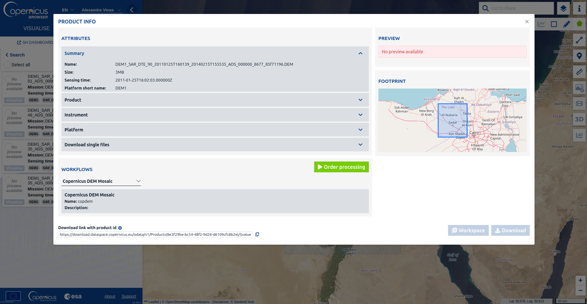

[README](../../README.md)

* [HOWTO](../Usage/HOWTO.md)
* [Inputs description](../Input/input_description.md)

  * [How to Download L1B Data from CDSE](../Input/L1B_CDSE_Download.md)
  * [How to Download Copernicus DEM for Sen2VM](../Input/DEM_CDSE_Download.md)

* Outputs description:

  * [Direct location grids](../Output/output_direct_loc.md)
  * [Inverse location grids](../Output/output_inverse_loc.md)
  * [Output grids usage](../Output/output_grids_usage.md)
  * [Notebooks](../../sen2vm-notebook/README_Notebooks.md)

# How to Download Copernicus DEM for Sen2VM

**Prerequisite:** A valid CDSE user account from [https://dataspace.copernicus.eu/](https://dataspace.copernicus.eu/)

---

## Introduction

Digital Elevation Models (DEM) are essential for geolocation and orthorectification in Sen2VM. Users can use different types of DEM (cf [Inputs Description](../Input/input_description.md)).

Sen2VM requires DEM data **organized per square degree** (see §[DEM format requirements](../Input/input_description.md#131-dem)) but can now also handle mosaic of square degrees. The recommended way to obtain Copernicus DEM in the correct format is to use the **[CDSE-Copernicus-DEM-downloader](https://github.com/senbox-org/CDSE-Copernicus-DEM-downloader)** tool, which downloads individual 1°×1° geocells from the Copernicus Data Space Ecosystem.

---

## Recommended Method: CDSE-Copernicus-DEM-downloader

The [CDSE-Copernicus-DEM-downloader](https://github.com/senbox-org/CDSE-Copernicus-DEM-downloader) is a lightweight tool that searches and downloads Copernicus DEM tiles by **Sentinel-2 MGRS tile identifiers**, producing the per-square-degree format required by Sen2VM.

> [!TIP]
> This tool is included in the Sen2VM project under `CDSE-Copernicus-DEM-downloader/`. If you use the bundled copy, adjust the paths below accordingly.

### Prerequisites

* [Conda](https://docs.conda.io/projects/conda/en/stable/user-guide/install/index.html) or [Miniconda](https://docs.conda.io/en/latest/miniconda.html)
* A valid CDSE user account (email and password)

### Installation

1. Clone the repository:

   ```bash
   git clone https://github.com/senbox-org/CDSE-Copernicus-DEM-downloader.git
   cd CDSE-Copernicus-DEM-downloader
   ```

2. Download the Copernicus Sentinel-2 tiling system KML file from [Sentiwiki](https://sentiwiki.copernicus.eu/__attachments/1692737/S2A_OPER_GIP_TILPAR_MPC__20151209T095117_V20150622T000000_21000101T000000_B00.zip), unzip it, and place the KML file in `./cdse-copernicus-dem-downloader/auxiliary/`.

3. Create and activate the conda environment:

   ```bash
   conda env create -f environment.yml
   conda activate cdse-copernicus-dem-downloader
   ```

### Usage

The tool accepts MGRS tile IDs (e.g. `32UMA`, `31TCJ`) or SAFE product names. Run from the `cdse-copernicus-dem-downloader/` directory.

**Single MGRS tile:**

```bash
python cdse_copernicus_dem_downloader.py --m DGED --r 90 --t 32UMA --o /path/to/output/DEM
```

**Multiple tiles from a text file:**

Create a file (e.g. `input_tiles.txt`) with one MGRS tile ID or SAFE filename per line:

```
32UMA
31TCJ
31TDG
```

Then run:

```bash
python cdse_copernicus_dem_downloader.py --m DGED --r 90 --i /path/to/input_tiles.txt --o /path/to/output/DEM
```

**Options:**

| Option | Description |
| ------ | ----------- |
| `--r {30,90}` | DEM resolution in metres (30 or 90) |
| `--m {DTED,DGED}` | DEM model (DGED recommended for Sen2VM) |
| `--t TILE` | Single MGRS tile ID |
| `--i FILE` | Input file with list of tiles |
| `--o DIR` | Output directory for DEM files |
| `--config [PATH]` | Use XML configuration file |
| `--reset` | Reset stored credentials |

> [!NOTE]
> On first run, you will be prompted for your CDSE username (email) and password. Credentials are encrypted and stored in `credentials/credentials.yaml` for later use.

> [!IMPORTANT]
> Sen2VM expects DGED format. DTED is not supported by Sen2Cor and may cause compatibility issues. Use `--m DGED`.

### Quick User Guide

A more detailed user guide is available: [CDSE DEM Downloader Quick User Guide](https://step.esa.int/thirdparties/sen2cor/2.12.0/docs/CDSE_DEM_Downloader_v1_3.pdf)

---

## Alternative: CDSE Browser Workflow (Not Recommended for Sen2VM)

The [Copernicus Data Space Browser](https://browser.dataspace.copernicus.eu/) offers a **Copernicus DEM Mosaic** workflow that produces a single raster covering your Area of Interest (AOI).

> [!WARNING]
> **Do not use this workflow for Sen2VM.** The DEM Mosaic outputs a single file that often spans **more than one square degree**. Sen2VM dynamically reads DEM data **per square degree** (cf [input_description.md §1.3.1](../Input/input_description.md#131-dem)). When given a mosaic larger than 1°×1°, the code only loads part of it, resulting in **geolocation without altitude data** over the rest of the scene—and thus incorrect orthorectification. Use the [CDSE-Copernicus-DEM-downloader](#recommended-method-cdse-copernicus-dem-downloader) instead.

If you still need to use the Browser workflow (e.g. for manual inspection or non-Sen2VM use):

1. Go to [https://browser.dataspace.copernicus.eu/](https://browser.dataspace.copernicus.eu/) and log in.
2. Define your AOI (polygon, file upload, or WKT).
3. Search for **Copernicus DEM**, select format and resolution.
4. Select a product, open the **Copernicus DEM Mosaic** workflow, and submit an order.
5. Download the result when processing is completed.



---

## Notes and Warnings

> [!NOTE]
> Copernicus DEM data is available in different formats and resolutions. Ensure you select the appropriate type for your use case (DGED recommended for Sen2VM).

> [!TIP]
> For more details, refer to the [official Copernicus DEM documentation](https://dataspace.copernicus.eu/explore-data/data-collections/copernicus-dem).

---

## References

* [CDSE-Copernicus-DEM-downloader (GitHub)](https://github.com/senbox-org/CDSE-Copernicus-DEM-downloader)
* [Copernicus Data Space Browser Documentation](https://documentation.dataspace.copernicus.eu/Applications/Browser.html)
* [Copernicus DEM Product Description](https://dataspace.copernicus.eu/explore-data/data-collections/copernicus-dem)
* [CDSE APIs Reference](https://documentation.dataspace.copernicus.eu/APIs.html)

---

[README](../../README.md)

* [HOWTO](../Usage/HOWTO.md)
* [Inputs description](../Input/input_description.md)

  * [How to Download L1B Data from CDSE](../Input/L1B_CDSE_Download.md)
  * [How to Download Copernicus DEM for Sen2VM](../Input/DEM_CDSE_Download.md)

* Outputs description:

  * [Direct location grids](../Output/output_direct_loc.md)
  * [Inverse location grids](../Output/output_inverse_loc.md)
  * [Output grids usage](../Output/output_grids_usage.md)
  * [Notebooks](../../sen2vm-notebook/README_Notebooks.md)
