[README](../../README.md)

* [HOWTO](../Usage/HOWTO.md)
* [Inputs](input_description.md)
  * [How to Download L1B Data from CDSE](L1B_CDSE_Download.md)
  * [How to Download DEM Data from CDSE](DEM_CDSE_Download.md)
* Outputs:

  * [Direct location grids](../Output/output_direct_loc.md)
  * [Inverse location grids](../Output/output_inverse_loc.md)
  * [Output grids usage](../Output/output_grids_usage.md)

# How to Download Sentinel-2 L1B Data from Copernicus Data Space Browser

**Prerequisite:** Expert User access (Sentinel-2 L1B products are only available to expert users on request):refs[1-2,65]

---

## Introduction

This guide explains how to download **Sentinel-2 L1B** data from the [Copernicus Data Space Browser](https://browser.dataspace.copernicus.eu/) at format COMPACT.SAFE, compatible with sen2vm. Sentinel-2 L1B products are raw data requiring expert knowledge for orthorectification and processing. Access to these products is restricted to **expert users** only:refs[3-2,65].

> [!IMPORTANT]
> To access Sentinel-2 L1B data, you must submit a request via the [FAQ section](https://documentation.dataspace.copernicus.eu/FAQ.html) of the Copernicus Data Space Ecosystem.

---

## Step-by-Step Download Process

### 1. Access the Copernicus Data Space Browser
Go to [https://browser.dataspace.copernicus.eu/](https://browser.dataspace.copernicus.eu/).
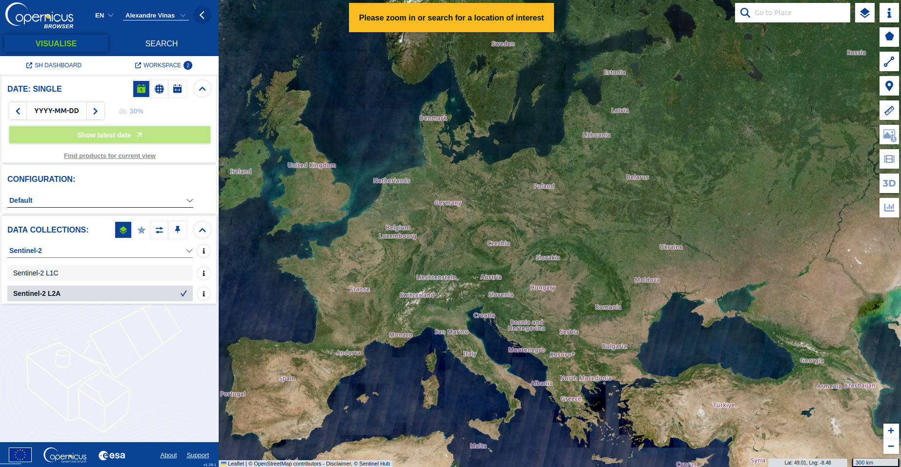

---

### 2. Define Area of Interest (AOI)
Click the polygon icon in the top-right corner to define your AOI.

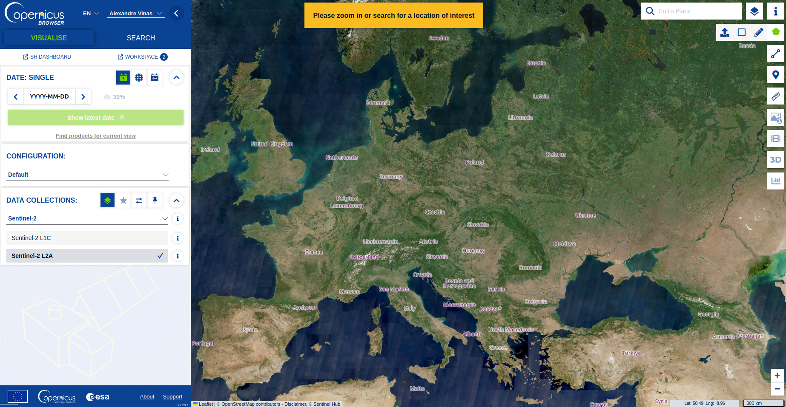

You can:
- Draw a polygon manually,
- Upload a file (e.g., GeoJSON, KML, WKT),
- Paste a WKT string (e.g., `POLYGON((30.7857 29.8194, 30.7857 30.2694, 31.6857 30.2694, 31.6857 29.8194, 30.7857 29.8194))` for a 50km square centered on Cairo).

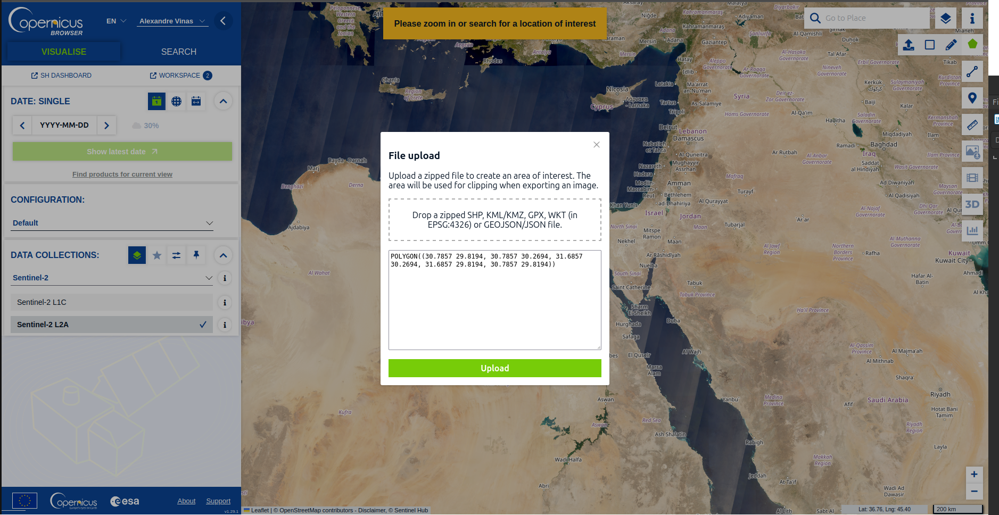

---

### 3. Switch to Search Mode
Select **"Sentinel-2"** from the mission list.
Choose the satellite (SA, SB, SC) and the product type.

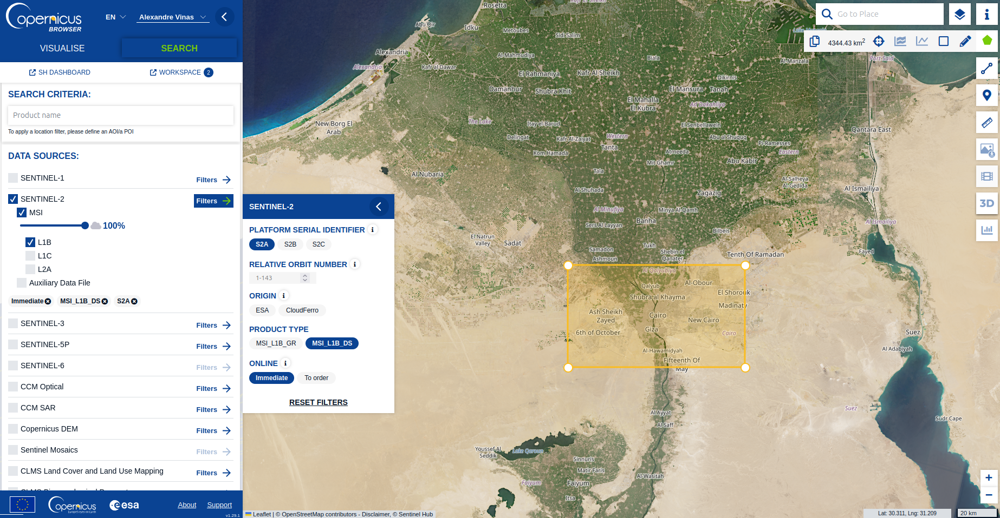

---

### 4. Set Date Range
Use the timeline at the bottom to select your desired date range.

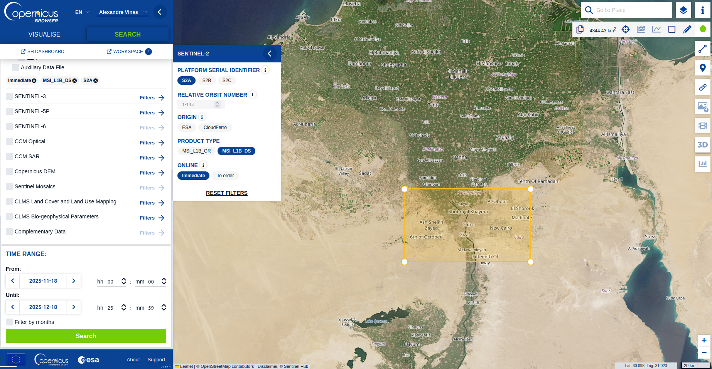

---

### 5. Select Product and View Metadata
Click on a product, then the information icon (i) to view metadata.

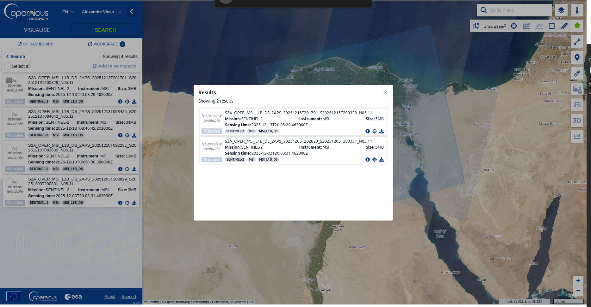

---

### 6. Choose Sentinel2\:L1B Workflow
In the product details, select the **"Sentinel2\:L1B"** workflow.

---

### 7. Configure Workflow Options
Set processing options (e.g., by AOI or tile).
For this example, use the AOI defined earlier.

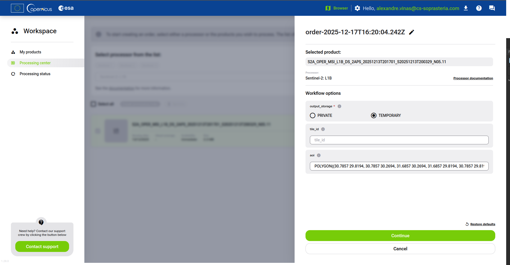

---

### 8. Submit Processing Order
Click **"Order Processing"** to submit your request.

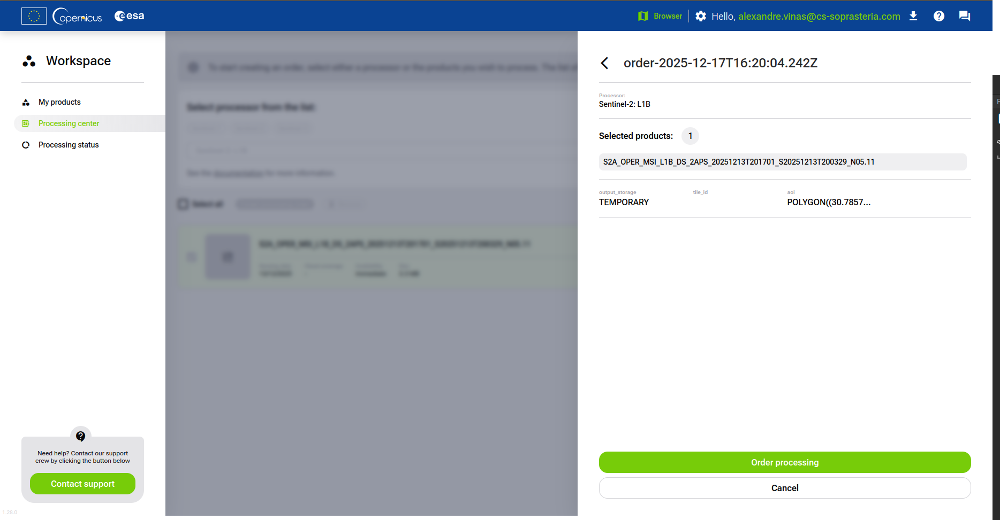

---

### 9. Monitor Processing Status
Check the **"Processing Status"** tab on the left for updates.

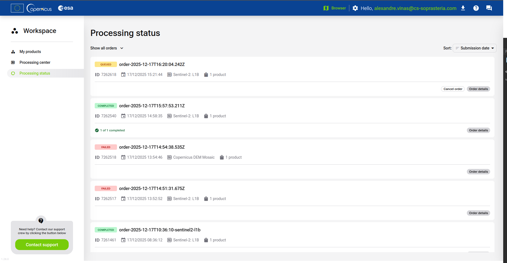

---

### 10. Download Completed Product
Once the status is **"Completed"**, download the product.

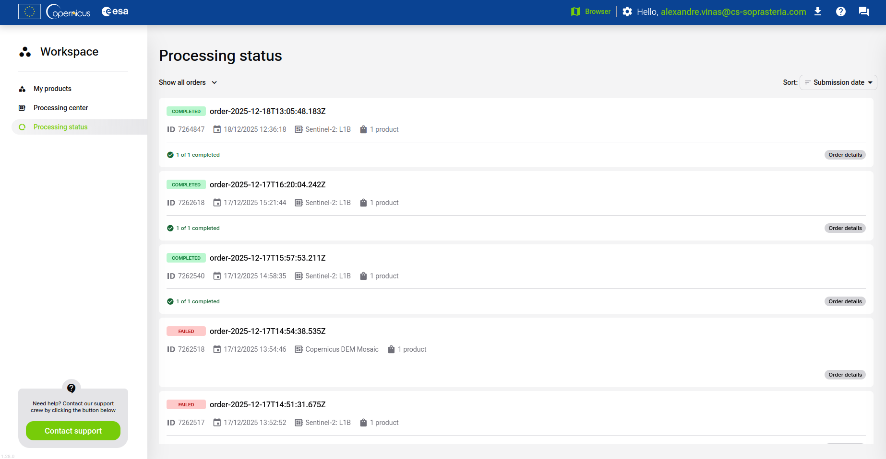

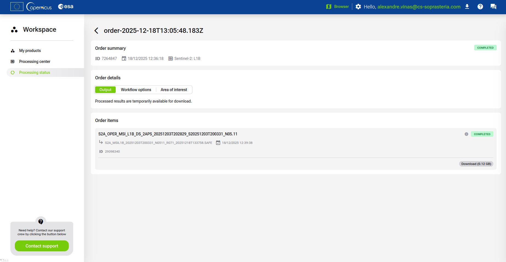

---

## Notes and Warnings

> [!NOTE]
> Sentinel-2 L1B products are only available to **expert users** and require a specific request:refs[25-2,65].

> [!WARNING]
> Ensure you have the necessary permissions and expertise to handle L1B data.

> [!TIP]
> For more details, refer to the [official documentation](https://documentation.dataspace.copernicus.eu/Data/SentinelMissions/Sentinel2.html) :refs[27-2].

---

## References
- [Copernicus Data Space Browser Documentation](https://documentation.dataspace.copernicus.eu/Applications/Browser.html)
- [Sentinel-2 L1B Product Description](https://documentation.dataspace.copernicus.eu/Data/SentinelMissions/Sentinel2.html)

---

[README](../../README.md)

* [HOWTO](../Usage/HOWTO.md)
* [Inputs](input_description.md)
  * [How to Download L1B Data from CDSE](L1B_CDSE_Download.md)
  * [How to Download DEM Data from CDSE](DEM_CDSE_Download.md)
* Outputs:

  * [Direct location grids](../Output/output_direct_loc.md)
  * [Inverse location grids](../Output/output_inverse_loc.md)
  * [Output grids usage](../Output/output_grids_usage.md)

